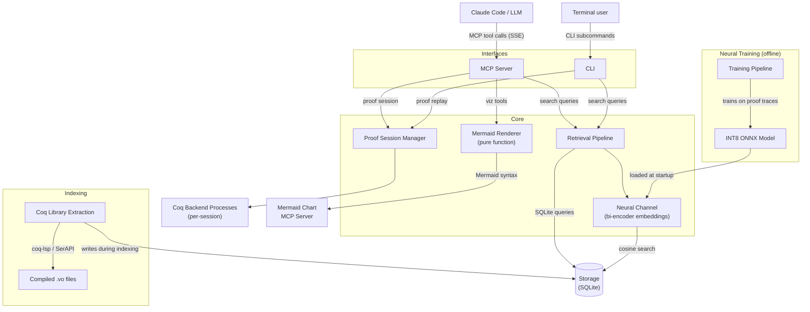

# Development

## Setup

### Requirements (host)

- [Docker](https://docs.docker.com/get-docker/)
- [Git](https://git-scm.com/)
- An [Anthropic API key](https://console.anthropic.com/) or Claude Code login

No local Coq, Python, or opam installation is needed. All development happens inside the container, which provides the full Coq/Rocq toolchain, coq-lsp, supported Coq libraries, and Python environment. Claude Code is baked into the Docker image at build time and symlinked into the persistent home directory on each launch.

### Clone and build

```bash
git clone https://github.com/ekirton/Poule.git
cd poule
```

### Using the launchers

Add the `bin/` directory to your PATH:

```bash
# Add to ~/.zshrc or ~/.bashrc
export PATH="/path/to/poule/bin:$PATH"
```

There are two launchers:

| Script | Image | Mount | Purpose |
|--------|-------|-------|---------|
| `poule-dev` | `poule:dev` (local build) | Project root at `/poule` | Development — live source edits |
| `poule` | `ghcr.io/ekirton/Poule` (registry) | Project dir at host path | End-user — baked-in source |

### Developer workflow

All development is done inside the container. From the project root:

```bash
poule-dev                       # Start interactive dev shell (your primary dev environment)
```

Inside the container shell, the project source is live-mounted at `/poule`. The full Coq toolchain, coq-lsp, and all Python dependencies are available without any local installation. Edits on the host are immediately visible.

```bash
poule-dev uv run pytest                     # Run tests with live source (recommended)
poule-dev uv run pytest -v                  # Verbose test output
poule-dev coqc --version                    # Run a Coq command in the container
```

On first run, `poule-dev` builds the dev image automatically from the `app-deps` stage of the Dockerfile.

The launchers manage:
- Image builds/pulls with proper host user mapping
- Persistent home directory at `~/poule-home/`
- Claude Code MCP server auto-configuration
- Search index download on first run

### MCP server lifecycle

The Poule MCP server runs in **streamable-HTTP mode** as a background daemon inside the container, so Claude Code connects to it over HTTP rather than via a spawned subprocess. This lets the developer (or Claude itself) restart the server after editing code without exiting Claude.

The `poule-mcp` script manages the server:

```bash
poule-mcp start      # Start the MCP server in background (port 3000)
poule-mcp stop       # Stop it
poule-mcp restart    # Restart after editing server code
poule-mcp status     # Check if running
poule-mcp logs       # Tail the server log
```

`poule-mcp` is available inside both the production image (`poule:latest`) and the dev image (`poule:dev`).

**Typical MCP development loop (inside the `poule-dev` container shell):**

```bash
poule-mcp start         # start the server
claude                  # open Claude — it connects to the running server
# edit src/poule/server/ on the host (live-mounted via poule-dev)
# ask Claude to restart the server:
#   "restart the MCP server"  →  Claude runs: poule-mcp restart
claude                  # open Claude again — picks up new code immediately
```

Environment variables to override defaults:

| Variable | Default | Description |
|----------|---------|-------------|
| `POULE_MCP_DB` | `/data/index.db` | Path to the search index |
| `POULE_MCP_PORT` | `3000` | HTTP listen port |

### Updating

The launchers pull the latest image (or rebuild the dev image) automatically. Claude Code is baked into the image at build time. On launch, the launcher checks npm for newer versions; if found, it defers the rebuild to exit time so your session isn't interrupted.

```bash
poule-dev --rebuild          # Force rebuild the dev image
poule-dev --no-auto-update   # Skip Claude Code version check
```

To download a newer search index:

```bash
rm ~/poule-home/data/index.db
poule   # Triggers automatic re-download
```

To also download the neural premise selection model:

```bash
poule-dev uv run python -m poule.cli download-index --output ~/data/index.db --include-model
```

## Architecture



The search subsystem (Retrieval Pipeline + Storage), proof interaction subsystem (Proof Session Manager + Coq Backend Processes), and visualization subsystem (Mermaid Renderer) are independent at runtime. The neural channel is optional — when no model checkpoint is available, the pipeline operates with symbolic channels only. The Mermaid Renderer is a pure function component with no external dependencies — it generates Mermaid syntax text that the Mermaid Chart MCP server renders into images.

### Retrieval Channels

| Channel | Method | Use Case |
|---------|--------|----------|
| WL Kernel | Weisfeiler-Lehman histogram cosine similarity | Fast structural screening (100K -> 500 candidates) |
| MePo | Iterative symbol-relevance with inverse-frequency weighting | Symbol-based discovery |
| FTS5 | SQLite full-text search with BM25 | Name and text matching |
| TED | Zhang-Shasha tree edit distance | Fine structural ranking (≤ 50 nodes) |
| Const Jaccard | Jaccard similarity of constant name sets | Lightweight complement |
| Neural | Bi-encoder cosine similarity (INT8 ONNX) | Learned semantic relevance |

Channels are combined via:
- **Fine-ranking weighted sum** for `search_by_structure`
- **Reciprocal Rank Fusion** (k=60) for `search_by_type` (includes neural channel when available)

## Project Structure

```
src/poule/
├── models/          # Core data types (labels, trees, enums, responses)
├── normalization/   # Coq term normalization + CSE
├── storage/         # SQLite read/write layer
├── channels/        # Retrieval channels (WL, MePo, FTS, TED, Jaccard)
├── fusion/          # Score fusion (weighted sum, RRF, collapse match)
├── pipeline/        # Query orchestration
├── extraction/      # Offline .vo file extraction
├── session/         # Proof session manager, types, errors
├── serialization/   # Proof state JSON serialization + diff computation
├── rendering/       # Mermaid diagram generation (proof state, tree, deps, sequence)
├── neural/          # Neural premise selection
│   ├── encoder.py       # ONNX Runtime encoder interface
│   ├── index.py         # Brute-force cosine search over embeddings
│   ├── channel.py       # Neural retrieval channel + availability checks
│   ├── embeddings.py    # Embedding write/read paths
│   └── training/        # Training pipeline (data, trainer, evaluator, quantizer, validator)
├── server/          # MCP server (handlers, validation, errors)
└── cli/             # CLI commands and output formatting
```

## Running Tests

Tests run inside the container, which provides the full Coq toolchain — all tests can run without exclusions.

```bash
# Dev mode: live source, no rebuild needed after editing
poule-dev uv run pytest

# Run tests for a specific module
poule-dev uv run pytest test/test_data_structures.py -v

# Run with coverage
poule-dev uv run pytest --cov=poule
```

`poule-dev` mounts the project root at `/poule` inside the container, so edits on the host are immediately visible without rebuilding. It must be run from the poule project root (the directory containing `src/` and `test/`).

Or enter the container shell first and run directly:

```bash
poule-dev
uv run pytest
```

## Pull Request Process

Work on a feature branch and open a PR against `main`. The branch name is for your own reference; the **PR title** is what matters — it becomes the commit message on `main` when the branch is squash-merged.

```bash
git checkout -b my-feature
# make changes, commit
git push origin my-feature
gh pr create --title "Clear description of the change"
```

If you omit `--title`, `gh` will prompt you interactively. Before merging, review the commit log and make sure the title accurately reflects the work — it becomes the squash commit message on `main`:

```bash
git log --oneline origin/main..HEAD
gh pr edit <number> --title "Better description"
```

Two CI checks must pass before merging:

| Check | Trigger |
|-------|---------|
| CI – Unit Tests | Automatic on every push |
| CI – Build & Integration Tests | Automatic on push to main and PRs targeting main |

The build & integration workflow builds the Docker image and runs the Coq integration tests (`pytest -m requires_coq`).

Once both checks are green, merge and delete the branch. PRs are merged as a single squash commit using the PR title as the commit message:

```bash
gh pr merge <number> --squash --delete-branch
```

To have GitHub merge automatically once checks pass, use the `--auto` flag:

```bash
gh pr merge <number> --auto --squash
```

To override the commit message at merge time:

```bash
gh pr merge <number> --squash --subject "Custom commit message"
```

## Publishing Releases

Prebuilt search indexes and neural model checkpoints are distributed via [GitHub Releases](https://github.com/ekirton/Poule/releases). Users can download them with `uv run python -m poule.cli download-index` instead of building from source.

### When to publish

Publish a new release when any of these change:
- Coq version (new stdlib declarations)
- Any supported library version (new library content)
- Index schema version (storage layer changes)
- Neural model (retrained or improved checkpoint)

### Prerequisites

- [`gh`](https://cli.github.com/) CLI, authenticated (`gh auth login`)
- `sqlite3` (reads version metadata from the index)
- `shasum` (computes checksums)

### Publishing

1. Build the index:

```bash
uv run python -m poule.extraction --target stdlib --db index-stdlib.db --progress
```

2. Publish with the index only:

```bash
./scripts/publish-release.sh index.db
```

3. Or include the neural model:

```bash
./scripts/publish-release.sh index.db --model path/to/neural-premise-selector.onnx
```

The script reads version metadata from each database, computes SHA-256 checksums, generates a `manifest.json`, and creates a tagged release. The tag format is `index-v{schema}-coq{coq_version}` (e.g., `index-v1-coq8.19`).

To replace an existing release (e.g., when updating a single library):

```bash
./scripts/publish-release.sh --replace index-stdlib.db index-mathcomp.db ...
```

### Release assets

| Asset | Description |
|-------|-------------|
| `index-stdlib.db` | Per-library index: Coq standard library |
| `index-mathcomp.db` | Per-library index: Mathematical Components |
| `index-stdpp.db` | Per-library index: std++ |
| `index-flocq.db` | Per-library index: Flocq |
| `index-coquelicot.db` | Per-library index: Coquelicot |
| `index-coqinterval.db` | Per-library index: CoqInterval |
| `manifest.json` | Version metadata and SHA-256 checksums |
| `neural-premise-selector.onnx` | INT8 ONNX model (optional) |

The download client (`src/poule/cli/download.py`) fetches `manifest.json` first, then downloads assets and verifies checksums before placing files. See [`specification/prebuilt-distribution.md`](specification/prebuilt-distribution.md) for the full protocol.

### Automated nightly re-index

A pair of scripts automates the release cycle:

| Script | Runs on | Purpose |
|--------|---------|---------|
| `scripts/nightly-reindex.sh` | Inside container | Detect new upstream library versions, re-extract changed libraries, publish updated release |
| `scripts/reindex-cron.sh` | Host machine | Thin wrapper that launches the container and runs the inner script |

The nightly script compares installed library versions (via `coqc` and `opam`) against the last-published release manifest. Only changed libraries are re-extracted; unchanged assets are carried forward. To schedule daily:

```bash
# Example crontab entry
0 3 * * * GH_TOKEN=ghp_... /path/to/scripts/reindex-cron.sh >> /var/log/poule-reindex.log 2>&1
```

Requires `GH_TOKEN` with `contents:write` scope. See [`specification/nightly-reindex.md`](specification/nightly-reindex.md) for the full protocol.

## Documentation Layers

| Layer | Location | Purpose |
|-------|----------|---------|
| Requirements | `doc/requirements/` | Business goals, user needs |
| Features | `doc/features/` | What and why |
| Architecture | `doc/architecture/` | How (language-agnostic design) |
| Specifications | `specification/` | Implementable contracts |
| Tasks | `tasks/` | Detailed implementation plans |
