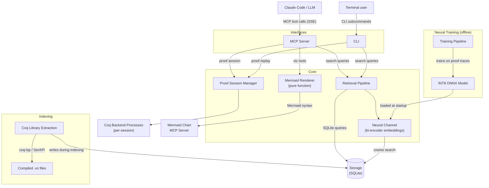

# Development

## Setup

### Requirements (host)

- [Docker](https://docs.docker.com/get-docker/)
- [Git](https://git-scm.com/)
- An [Anthropic API key](https://console.anthropic.com/) or Claude Code login
- [`npm`](https://docs.npmjs.com/downloading-and-installing-node-js-and-npm) (for Claude Code version detection)

No local Coq, Python, or opam installation is needed. All development happens inside the container, which provides the full Coq/Rocq toolchain, coq-lsp, MathComp, Python environment, and Claude Code.

### Clone and build

```bash
git clone https://github.com/ekirton/poule.git
cd poule
```

### Using the launcher

Add the `bin/` directory to your PATH:

```bash
# Add to ~/.zshrc or ~/.bashrc
export PATH="/path/to/poule/bin:$PATH"
```

The first time you run `poule`, it builds the Docker image automatically.

### Developer workflow

All development is done inside the container. From the project root:

```bash
poule                           # Start interactive shell (your primary dev environment)
```

Inside the container shell, the project source is mounted at its host path and a pre-built Python environment is available at `/app`. The full Coq toolchain, coq-lsp, and all Python dependencies are available without any local installation.

```bash
poule --dev uv run pytest                   # Run tests with live source (recommended)
poule --dev uv run pytest -v                # Verbose test output
poule uv run --project /app pytest          # Run tests (baked-in source)
poule coqc --version                        # Run a Coq command in the container
```

The launcher manages:
- Image builds with proper host user mapping
- Persistent home directory at `~/poule-home/`
- Claude Code MCP server auto-configuration
- Search index download on first run
- Automatic Claude Code updates (deferred to session exit)

### MCP server lifecycle

The Poule MCP server runs in **SSE mode** as a background daemon inside the container, so Claude Code connects to it over HTTP rather than via a spawned subprocess. This lets the developer (or Claude itself) restart the server after editing code without exiting Claude.

The `poule-mcp` script manages the server:

```bash
poule-mcp start      # Start the MCP server in background (port 3000)
poule-mcp stop       # Stop it
poule-mcp restart    # Restart after editing server code
poule-mcp status     # Check if running
poule-mcp logs       # Tail the server log
```

`poule-mcp` is available inside both the production image (`poule:latest`) and the dev image (`poule:dev`).

**Typical MCP development loop (inside the container shell):**

```bash
poule-mcp start         # start the server
claude                  # open Claude — it connects to the running server
# edit src/poule/server/ on the host (live-mounted in --dev mode)
# ask Claude to restart the server:
#   "restart the MCP server"  →  Claude runs: poule-mcp restart
claude                  # open Claude again — picks up new code immediately
```

Environment variables to override defaults:

| Variable | Default | Description |
|----------|---------|-------------|
| `POULE_MCP_DB` | `/data/index.db` | Path to the search index |
| `POULE_MCP_PORT` | `3000` | SSE listen port |

### Updating

```bash
poule --rebuild              # Update Claude CLI (uses cache)
poule --rebuild-all          # Full rebuild from scratch
```

To download a newer search index:

```bash
rm ~/poule-home/data/index.db
poule   # Triggers automatic re-download
```

To also download the neural premise selection model:

```bash
poule uv run --project /app python -m poule.cli download-index --output ~/data/index.db --include-model
```

## Architecture



The search subsystem (Retrieval Pipeline + Storage), proof interaction subsystem (Proof Session Manager + Coq Backend Processes), and visualization subsystem (Mermaid Renderer) are independent at runtime. The neural channel is optional — when no model checkpoint is available, the pipeline operates with symbolic channels only. The Mermaid Renderer is a pure function component with no external dependencies — it generates Mermaid syntax text that the Mermaid Chart MCP server renders into images.

### Retrieval Channels

| Channel | Method | Use Case |
|---------|--------|----------|
| WL Kernel | Weisfeiler-Lehman histogram cosine similarity | Fast structural screening (100K -> 500 candidates) |
| MePo | Iterative symbol-relevance with inverse-frequency weighting | Symbol-based discovery |
| FTS5 | SQLite full-text search with BM25 | Name and text matching |
| TED | Zhang-Shasha tree edit distance | Fine structural ranking (≤ 50 nodes) |
| Const Jaccard | Jaccard similarity of constant name sets | Lightweight complement |
| Neural | Bi-encoder cosine similarity (INT8 ONNX) | Learned semantic relevance |

Channels are combined via:
- **Fine-ranking weighted sum** for `search_by_structure`
- **Reciprocal Rank Fusion** (k=60) for `search_by_type` (includes neural channel when available)

## Project Structure

```
src/poule/
├── models/          # Core data types (labels, trees, enums, responses)
├── normalization/   # Coq term normalization + CSE
├── storage/         # SQLite read/write layer
├── channels/        # Retrieval channels (WL, MePo, FTS, TED, Jaccard)
├── fusion/          # Score fusion (weighted sum, RRF, collapse match)
├── pipeline/        # Query orchestration
├── extraction/      # Offline .vo file extraction
├── session/         # Proof session manager, types, errors
├── serialization/   # Proof state JSON serialization + diff computation
├── rendering/       # Mermaid diagram generation (proof state, tree, deps, sequence)
├── neural/          # Neural premise selection
│   ├── encoder.py       # ONNX Runtime encoder interface
│   ├── index.py         # Brute-force cosine search over embeddings
│   ├── channel.py       # Neural retrieval channel + availability checks
│   ├── embeddings.py    # Embedding write/read paths
│   └── training/        # Training pipeline (data, trainer, evaluator, quantizer, validator)
├── server/          # MCP server (handlers, validation, errors)
└── cli/             # CLI commands and output formatting
```

## Running Tests

Tests run inside the container, which provides the full Coq toolchain — all tests can run without exclusions.

```bash
# Dev mode: live source, no rebuild needed after editing
poule --dev uv run pytest

# Normal mode (source is baked in — rebuild to pick up changes)
poule uv run --project /app pytest

# Run tests for a specific module
poule --dev uv run pytest test/test_data_structures.py -v

# Run with coverage
poule --dev uv run pytest --cov=poule
```

`--dev` mounts `src/` and `test/` directly into the container, so edits on the host are immediately visible without rebuilding. It must be run from the poule project root (the directory containing `src/` and `test/`).

Or enter the container shell first and run directly:

```bash
poule --dev
uv run pytest
```

## Publishing Releases

Prebuilt search indexes and neural model checkpoints are distributed via [GitHub Releases](https://github.com/ekirton/poule/releases). Users can download them with `uv run python -m poule.cli download-index` instead of building from source.

### When to publish

Publish a new release when any of these change:
- Coq version (new stdlib declarations)
- MathComp version (new library content)
- Index schema version (storage layer changes)
- Neural model (retrained or improved checkpoint)

### Prerequisites

- [`gh`](https://cli.github.com/) CLI, authenticated (`gh auth login`)
- `sqlite3` (reads version metadata from the index)
- `shasum` (computes checksums)

### Publishing

1. Build the index:

```bash
uv run python -m poule.extraction --target stdlib+mathcomp --db index.db --progress
```

2. Publish with the index only:

```bash
./scripts/publish-release.sh index.db
```

3. Or include the neural model:

```bash
./scripts/publish-release.sh index.db --model path/to/neural-premise-selector.onnx
```

The script reads `schema_version`, `coq_version`, and `mathcomp_version` from the database's `index_meta` table, computes SHA-256 checksums, generates a `manifest.json`, and creates a tagged release. The tag format is `index-v{schema}-coq{coq_version}-mc{mathcomp_version}` (e.g., `index-v1-coq8.19-mc2.2.0`).

### Release assets

| Asset | Description |
|-------|-------------|
| `index.db` | SQLite search index |
| `manifest.json` | Version metadata and SHA-256 checksums |
| `neural-premise-selector.onnx` | INT8 ONNX model (optional) |

The download client (`src/poule/cli/download.py`) fetches `manifest.json` first, then downloads assets and verifies checksums before placing files. See [`specification/prebuilt-distribution.md`](specification/prebuilt-distribution.md) for the full protocol.

## Documentation Layers

| Layer | Location | Purpose |
|-------|----------|---------|
| Requirements | `doc/requirements/` | Business goals, user needs |
| Features | `doc/features/` | What and why |
| Architecture | `doc/architecture/` | How (language-agnostic design) |
| Specifications | `specification/` | Implementable contracts |
| Tasks | `tasks/` | Detailed implementation plans |
