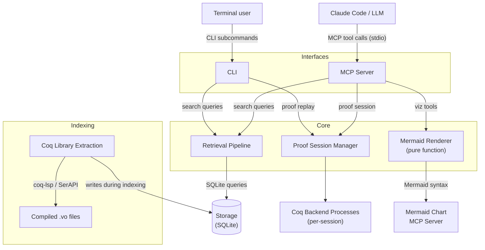

# Poule

Semantic lemma search, interactive proof exploration, and proof visualization for Coq/Rocq libraries, exposed as an MCP server for Claude Code.

Poule indexes compiled Coq `.vo` libraries into a SQLite database and provides structural, symbol-based, lexical, and type-based search through a multi-channel retrieval pipeline with reciprocal rank fusion. It also provides an interactive proof session protocol for observing proof states, submitting tactics, and extracting premise annotations. Proof states, proof trees, and dependency subgraphs can be visualized as Mermaid diagrams via the [Mermaid Chart MCP](https://github.com/Mermaid-Chart/mermaid-mcp-server) service.

## Features

### Search

- **Structural search** — find declarations with similar expression tree structure using Weisfeiler-Lehman graph kernels, tree edit distance, and collapse matching
- **Symbol search** — MePo-style iterative relevance filtering based on weighted symbol overlap
- **Lexical search** — FTS5 full-text search over declaration names, statements, and modules
- **Type search** — multi-channel fusion combining structural, symbol, and lexical results
- **Dependency navigation** — explore `uses`, `used_by`, `same_module`, and `same_typeclass` relationships
- **Module browsing** — list and filter indexed Coq modules

### Proof Interaction

- **Session management** — open, close, and list interactive proof sessions against `.v` files
- **Proof state observation** — view goals, hypotheses, and focused goal at any step
- **Tactic submission** — submit tactics and receive the resulting proof state or structured errors
- **Step navigation** — step forward through existing proofs or backward to undo
- **Proof trace extraction** — extract the full sequence of states and tactics for a completed proof
- **Premise annotation** — identify which lemmas, hypotheses, constructors, and definitions each tactic used
- **Batch tactics** — submit multiple tactics in a single request (P1)
- **Concurrent sessions** — multiple independent proof sessions with isolated state

### Proof Visualization

- **Proof state diagrams** — render goals, hypotheses, and local context as Mermaid flowcharts with three detail levels (summary, standard, detailed)
- **Proof tree diagrams** — render completed proofs as top-down trees showing tactic applications and branching structure
- **Dependency subgraphs** — render theorem dependency neighborhoods as Mermaid directed graphs with depth limiting
- **Step-by-step sequences** — render proof evolution as a series of diagrams with diff highlighting for added/removed/changed elements
- **Mermaid Chart MCP integration** — generated Mermaid syntax is rendered visually via the Mermaid Chart MCP service

## Requirements

- Python 3.11+
- [uv](https://docs.astral.sh/uv/) (recommended package manager)
- [Claude Code](https://docs.anthropic.com/en/docs/claude-code) (Anthropic's agentic coding tool — used to interact with the MCP server)
- Coq/Rocq 8.19+ (for indexing and proof interaction)
- coq-lsp or SerAPI (for `.vo` file extraction and proof backend)

### Installing Claude Code

Claude Code is Anthropic's CLI tool for agentic coding with Claude. Install it globally via npm:

```bash
npm install -g @anthropic-ai/claude-code
```

Then launch it in any project directory with `claude`. For full installation instructions, system requirements, and configuration options, see the [official Claude Code documentation](https://docs.anthropic.com/en/docs/claude-code).

## Installation

### Coq Toolchain

Install [opam](https://opam.ocaml.org/) (OCaml's package manager), then use it to install Coq:

```bash
# macOS
brew install opam hg darcs

# Linux (Debian/Ubuntu)
sudo apt-get update && sudo apt-get install -y bubblewrap mercurial darcs
bash -c "sh <(curl -fsSL https://opam.ocaml.org/install.sh)"

# Linux (Fedora/RHEL)
sudo dnf install -y bubblewrap mercurial darcs
bash -c "sh <(curl -fsSL https://opam.ocaml.org/install.sh)"

# Linux (Arch)
sudo pacman -S opam bubblewrap mercurial darcs

# Windows — use WSL2 with a Ubuntu distribution, then follow the Debian/Ubuntu
# instructions above. Native Windows is not supported by opam.
# See https://learn.microsoft.com/en-us/windows/wsl/install
```

Then initialise opam and install Coq (all platforms, including WSL2):

```bash
opam init

# Install Coq and the extraction backend
opam install coq coq-lsp

# Add the Coq package repository (required for MathComp)
opam repo add coq-released https://coq.inria.fr/opam/released

# For MathComp indexing
opam install coq-mathcomp-ssreflect

# Make coqc available in your shell (add to .zshrc / .bashrc for persistence)
eval $(opam env)
```

Verify the installation:

```bash
coqc --version
```

### Python Package

```bash
# Clone the repository
git clone https://github.com/ekirton/poule.git
cd poule

# Install with uv
uv sync

# Install dev dependencies (for testing)
uv sync --group dev
```

## Quick Start

### 1. Index a Coq Library

Build the search index from your installed Coq standard library and MathComp:

```bash
uv run python -m poule.extraction --target stdlib+mathcomp --db index.db --progress
```

This runs the offline extraction pipeline:
1. Discovers `.vo` files from installed Coq libraries
2. Extracts declarations via coq-lsp or SerAPI
3. Normalizes expression trees (currification, cast stripping, CSE)
4. Computes WL histogram vectors and symbol sets
5. Resolves dependency edges
6. Writes everything to a single SQLite database

Pass `--progress` to see extraction status on stderr:
```
Discovering libraries...
Discovered 312 .vo files
Collecting declarations [1/312]
Extracting declarations [1234/5678]
Resolving dependencies [1234/5678]
Computing symbol frequencies...
Finalizing index...
```

### 2. Search from the Command Line

All search tools are available as standalone CLI commands via `python -m poule.cli`:

```bash
# Search by name (glob or substring)
uv run python -m poule.cli search-by-name --db index.db "Nat.add_comm"

# Search by type signature (multi-channel fusion)
uv run python -m poule.cli search-by-type --db index.db "nat -> nat -> nat"

# Search by structural similarity
uv run python -m poule.cli search-by-structure --db index.db "forall n, n + 0 = n"

# Search by symbol names (space-separated)
uv run python -m poule.cli search-by-symbols --db index.db Coq.Init.Nat.add Coq.Init.Datatypes.nat

# Get full details for a specific declaration
uv run python -m poule.cli get-lemma --db index.db "Coq.Arith.PeanoNat.Nat.add_comm"

# Navigate the dependency graph
uv run python -m poule.cli find-related --db index.db --relation uses "Coq.Arith.PeanoNat.Nat.add_comm"

# Browse the module hierarchy
uv run python -m poule.cli list-modules --db index.db "Coq.Arith"
```

All search commands accept `--limit N` (default 50, max 200) and `--json` for machine-readable output.

### 3. Replay a Proof from the Terminal

Extract the complete proof trace for a named proof in a `.v` file. An example file is included at [`examples/arith.v`](examples/arith.v):

```bash
# Human-readable output
uv run python -m poule.cli replay-proof examples/arith.v add_comm

# JSON output (for scripts and pipelines)
uv run python -m poule.cli replay-proof examples/arith.v add_comm --json

# Include per-step premise annotations
uv run python -m poule.cli replay-proof examples/arith.v add_comm --json --premises
```

No search index is needed — `replay-proof` works directly with `.v` files through the Coq backend.

### 4. Start the MCP Server

```bash
uv run python -m poule.server --db index.db
```

The server communicates via stdio, compatible with Claude Code's MCP configuration.

### 5. Configure Claude Code

Add to your Claude Code MCP config (`~/.claude/mcp.json`):

```json
{
  "mcpServers": {
    "coq-search": {
      "command": "uv",
      "args": ["run", "--project", "/path/to/poule", "python", "-m", "poule.server", "--db", "/path/to/poule/index.db"]
    },
    "mermaid": {
      "command": "npx",
      "args": ["-y", "@mermaidchart/mcp-server"]
    }
  }
}
```

Replace `/path/to/poule` with the absolute path to your cloned repository.

The `mermaid` entry adds the [Mermaid Chart MCP server](https://github.com/Mermaid-Chart/mermaid-mcp-server), which renders Mermaid syntax produced by the visualization tools into diagrams. When both servers are configured, Claude Code can visualize proof states, proof trees, and dependency graphs by calling a visualization tool to generate the Mermaid syntax and then passing it to the Mermaid Chart MCP for rendering.

## MCP Tools

Once configured, Claude Code has access to 7 search tools, 12 proof interaction tools, and 4 visualization tools:

### Search Tools

| Tool | Description | Example |
|------|-------------|---------|
| `search_by_name` | Find declarations by name pattern | `"Nat.add_comm"` |
| `search_by_type` | Find declarations matching a type signature | `"nat -> nat -> nat"` |
| `search_by_structure` | Find structurally similar declarations | `"forall n, n + 0 = n"` |
| `search_by_symbols` | Find declarations using specific symbols | `["Coq.Init.Nat.add", "Coq.Init.Datatypes.nat"]` |
| `get_lemma` | Get full details for a named declaration | `"Coq.Arith.PeanoNat.Nat.add_comm"` |
| `find_related` | Navigate the dependency graph | `relation: "uses" \| "used_by" \| "same_module" \| "same_typeclass"` |
| `list_modules` | Browse indexed module hierarchy | `prefix: "Coq.Arith"` |

All search tools accept an optional `limit` parameter (default 50, max 200).

### Proof Interaction Tools

| Tool | Description |
|------|-------------|
| `open_proof_session` | Start an interactive session for a named proof in a `.v` file |
| `close_proof_session` | Terminate a session and release its Coq backend process |
| `list_proof_sessions` | List all active proof sessions with metadata |
| `observe_proof_state` | Get the current proof state (goals, hypotheses, focused goal) |
| `get_proof_state_at_step` | Get the proof state at a specific step index |
| `extract_proof_trace` | Get the full proof trace (all states + tactics) |
| `submit_tactic` | Submit a tactic and receive the resulting proof state |
| `step_backward` | Undo the last tactic, returning to the previous state |
| `step_forward` | Replay the next tactic from the original proof script |
| `submit_tactic_batch` | Submit multiple tactics in sequence (P1) |
| `get_proof_premises` | Get premise annotations for all tactic steps |
| `get_step_premises` | Get premise annotations for a single step |

Proof interaction tools work independently of the search index — no indexing is required.

### Visualization Tools

| Tool | Description |
|------|-------------|
| `visualize_proof_state` | Render the current proof state as a Mermaid diagram (goals, hypotheses, context) |
| `visualize_proof_tree` | Render a completed proof as a Mermaid tree diagram (tactic edges, subgoal nodes) |
| `visualize_dependencies` | Render a theorem's dependency subgraph as a Mermaid directed graph |
| `visualize_proof_sequence` | Render step-by-step proof evolution as a sequence of Mermaid diagrams with diffs |

Visualization tools generate Mermaid syntax text — they do not render images directly. Use the Mermaid Chart MCP service (see below) to render the diagrams visually.

## Architecture



The search subsystem (Retrieval Pipeline + Storage), proof interaction subsystem (Proof Session Manager + Coq Backend Processes), and visualization subsystem (Mermaid Renderer) are independent at runtime. The Mermaid Renderer is a pure function component with no external dependencies — it generates Mermaid syntax text that the Mermaid Chart MCP server renders into images.

### Retrieval Channels

| Channel | Method | Use Case |
|---------|--------|----------|
| WL Kernel | Weisfeiler-Lehman histogram cosine similarity | Fast structural screening (100K -> 500 candidates) |
| MePo | Iterative symbol-relevance with inverse-frequency weighting | Symbol-based discovery |
| FTS5 | SQLite full-text search with BM25 | Name and text matching |
| TED | Zhang-Shasha tree edit distance | Fine structural ranking (≤ 50 nodes) |
| Const Jaccard | Jaccard similarity of constant name sets | Lightweight complement |

Channels are combined via:
- **Fine-ranking weighted sum** for `search_by_structure`
- **Reciprocal Rank Fusion** (k=60) for `search_by_type`

## Development

### Running Tests

```bash
# Run all tests
uv run pytest

# Run tests for a specific module
uv run pytest test/test_data_structures.py -v

# Run with coverage
uv run pytest --cov=poule

# Skip tests requiring Coq installation
uv run pytest -m "not requires_coq"
```

### Project Structure

```
src/poule/
├── models/          # Core data types (labels, trees, enums, responses)
├── normalization/   # Coq term normalization + CSE
├── storage/         # SQLite read/write layer
├── channels/        # Retrieval channels (WL, MePo, FTS, TED, Jaccard)
├── fusion/          # Score fusion (weighted sum, RRF, collapse match)
├── pipeline/        # Query orchestration
├── extraction/      # Offline .vo file extraction
├── session/         # Proof session manager, types, errors
├── serialization/   # Proof state JSON serialization + diff computation
├── rendering/       # Mermaid diagram generation (proof state, tree, deps, sequence)
├── server/          # MCP server (handlers, validation, errors)
└── cli/             # CLI commands and output formatting
```

### Documentation Layers

| Layer | Location | Purpose |
|-------|----------|---------|
| Requirements | `doc/requirements/` | Business goals, user needs |
| Features | `doc/features/` | What and why |
| Architecture | `doc/architecture/` | How (language-agnostic design) |
| Specifications | `specification/` | Implementable contracts |
| Tasks | `tasks/` | Detailed implementation plans |

## License

See [LICENSE](LICENSE) and [NOTICE](NOTICE).
