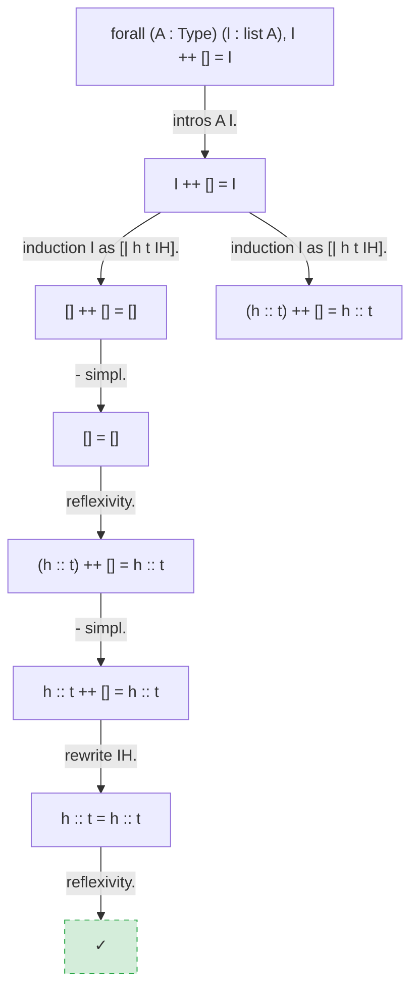

# Poule à Coq

*"Un coq a bien besoin d'une poule."
(A rooster really needs a hen.)*

Poule ("Hen") supports the Coq ("Rooster") procedural logic community.

Semantic lemma search, interactive proof exploration, and proof visualization for Coq/Rocq libraries — delivered as an MCP server for [Claude Code](https://docs.anthropic.com/en/docs/claude-code).

Poule indexes compiled Coq `.vo` libraries into a SQLite database and provides multi-channel retrieval (structural, symbol, lexical, neural, type-based) with reciprocal rank fusion. It also supports interactive proof sessions and Mermaid-based visualization of proof states, proof trees, and dependency graphs.

Six Coq libraries are available as prebuilt indexes: **stdlib**, **MathComp**, **std++**, **Flocq**, **Coquelicot**, and **CoqInterval**. All 6 are downloaded and merged into a single searchable index — no configuration required.

## Features

### Search

- **Structural** — Weisfeiler-Lehman graph kernels, tree edit distance, and collapse matching
- **Symbol** — MePo-style iterative relevance filtering with weighted symbol overlap
- **Lexical** — FTS5 full-text search over names, statements, and modules
- **Neural** — bi-encoder embeddings (INT8, CPU-only) fused with symbolic channels via RRF
- **Type** — multi-channel fusion combining all of the above
- **Dependency navigation** — `uses`, `used_by`, `same_module`, `same_typeclass`

### Neural Premise Selection

- Train a bi-encoder on proof traces with masked contrastive loss and hard negative mining
- Evaluate with Recall@k and MRR; compare neural vs. symbolic retrieval
- Fine-tune on project-specific proofs; export to INT8 ONNX for <10ms CPU inference
- Graceful degradation — search works identically without a model checkpoint

### Proof Interaction

- Open interactive proof sessions against `.v` files
- Observe proof states, submit tactics, step forward/backward
- Extract full proof traces with per-step premise annotations
- Batch tactic submission and concurrent sessions

### Visualization

- Proof state, proof tree, dependency subgraph, and step-by-step sequence diagrams
- Generated as Mermaid syntax; each visualization tool call writes a self-contained `proof-diagram.html` to your project directory
- Open `proof-diagram.html` in your browser and bookmark it — refresh after each visualization to see the latest diagram
- Poule always overwrites the same `proof-diagram.html` path — rename or copy the file if you want to keep a diagram

**Example:** proof tree for `app_nil_r` (`forall (A : Type) (l : list A), l ++ [] = l`)



## Quick Start

Requires [Docker](https://docs.docker.com/get-docker/) and an [Anthropic API key](https://console.anthropic.com/).

**1. Get the launcher script**

```bash
curl -fsSL https://raw.githubusercontent.com/ekirton/Poule/main/bin/poule -o ~/bin/poule && chmod +x ~/bin/poule
```

Or, if you prefer to clone the repo:

```bash
git clone https://github.com/ekirton/Poule.git
cp poule/bin/poule ~/bin/poule
chmod +x ~/bin/poule
```

**2. Add to your `~/.zshrc`**

```bash
export ANTHROPIC_API_KEY=sk-ant-...          # your Anthropic API key
export POULE_PROJECT_DIR=~/Projects/my-coq-project   # your Coq project
```

Make sure `~/bin` is on your `PATH` (add `export PATH="$HOME/bin:$PATH"` if needed).

**3. Run**

```bash
poule          # launches Claude Code with your project mounted
```

Everything runs inside the container — no local Coq, Python, or opam installation required. All six supported libraries are pre-installed in the container for proof interaction. Claude Code is baked into the image for instant startup. On first run, the launcher pulls the image, initializes a persistent home directory at `~/poule-home`, and downloads the search index for all 6 libraries automatically.

To run a one-off command instead:

```bash
poule coqc --version   # run a command in the container
```

If you want to use a different project for a one-off session, just `cd` into it and run `poule` — the launcher falls back to `$PWD` when `POULE_PROJECT_DIR` is not set.

### Library indexes

All 6 supported libraries are indexed automatically on first run. The container checks whether the search index is present on every startup and downloads it if missing. A startup message confirms which libraries are currently indexed.

### Persistent home directory

State is preserved across sessions in `~/poule-home`:

```
~/poule-home/
├── .claude/          # Claude Code settings, MCP config, auth
└── data/
    └── index.db      # Coq search index (downloaded on first run)
```

To set up git and SSH inside the container, copy your existing config:

```bash
cp ~/.gitconfig ~/poule-home/.gitconfig
cp -r ~/.ssh ~/poule-home/.ssh
```

### Updating

The launcher pulls the latest image each time it runs and checks for Claude Code updates. If a newer Claude Code version is available, it defers the update to exit time so your session isn't interrupted.

```bash
poule --update           # Pull latest image + update library indexes
poule --no-pull          # Skip pulling the latest image
poule --no-auto-update   # Skip Claude Code update check
poule --rebuild          # Force update Claude Code immediately
```

To force re-download of the search index:

```bash
rm ~/poule-home/data/index.db
poule    # re-download triggers automatically on next startup
```

## Use with Claude Code

[Claude Code](https://docs.anthropic.com/en/docs/claude-code) is Anthropic's agentic coding tool — you interact with it in natural language from your terminal. Poule extends Claude's capabilities through the [Model Context Protocol (MCP)](https://modelcontextprotocol.io/): when you ask Claude a question about Coq, it automatically calls the right Poule tools behind the scenes and presents the results in plain language. You never need to invoke Poule tools directly.

For example, you can ask Claude things like:

**Search:**
- *"Find lemmas about list reversal being involutive"*
- *"Search for lemmas with type `forall n : nat, n + 0 = n`"*
- *"What's in the Coq.Arith module?"*

**Proof interaction:**
- *"Open a proof session on `rev_involutive` in `examples/lists.v` and show me the current goal"*
- *"Step through the proof of `add_comm` in `examples/arith.v` and explain each tactic"*
- *"Try applying `intros` then `induction n` in my current proof session"*

**Dependencies:**
- *"What lemmas does `Nat.add_comm` depend on?"*
- *"Which lemmas use `Nat.add_0_r`?"*
- *"Show me other lemmas in the same module as `List.rev_append`"*

**Visualization:**
- *"Visualize the proof tree for `app_nil_r` in `examples/lists.v`"*
- *"Show me the dependency graph around `Nat.add_comm`"*
- *"Render the step-by-step proof evolution of `modus_ponens` in `examples/logic.v`"*

Claude will search the index, manage proof sessions, and generate diagrams on your behalf. When Claude calls a visualization tool, it writes `proof-diagram.html` to your project directory (the folder you started `poule` from, or `POULE_PROJECT_DIR` if set) — open it in your browser to see the rendered diagram. Bookmark the file and refresh after each visualization call.

**Skills (slash commands):**

Poule also provides compound workflows that orchestrate multiple tools in a single command:

- *`/formalize For all natural numbers, addition is commutative`* — Claude searches for existing lemmas, proposes a formal Coq statement, type-checks it, and helps build the proof interactively
- *`/explain-proof Nat.add_comm`* — step through a proof with plain-language explanations of each tactic, including mathematical intuition
- *`/compress-proof rev_involutive in src/Lists.v`* — find shorter proof alternatives, verify each one, present ranked options
- *`/proof-obligations`* — scan your project for `admit`/`Admitted`/`Axiom`, classify intent, rank by severity
- *`/proof-repair`* — after a Coq version upgrade, systematically fix broken proofs through a build→fix→rebuild loop
- *`/proof-lint src/Core.v`* — detect deprecated tactics, inconsistent bullets, and complex tactic chains; optionally auto-fix
- *`/explain-error`* — parse a Coq type error, fetch relevant definitions, explain the root cause in plain language with fix suggestions
- *`/migrate-rocq`* — bulk-rename deprecated `Coq.*` namespaces to `Rocq.*` with build verification
- *`/check-compat`* — check dependency compatibility before you hit opaque build failures
- *`/scaffold`* — generate a complete project skeleton (Dune, opam, CI, boilerplate)

For the full list of skills and their details, see [Skills Reference](doc/SKILLS.md).

**Capabilities provided to Claude:**

| Category | What Claude can do |
|----------|--------------------|
| **Search** | Find lemmas by name, type signature, structural similarity, or symbol usage; navigate dependencies; browse modules |
| **Proof interaction** | Open interactive proof sessions, observe goal states, submit tactics, step through proofs, extract traces with premise annotations |
| **Visualization** | Render proof states, proof trees, dependency graphs, and step-by-step proof evolution as Mermaid diagrams — written to `proof-diagram.html` in your project directory for browser viewing |
| **Skills** | Compound agentic workflows: formalization, proof compression, explanation, linting, repair, migration, compatibility analysis, error diagnosis, scaffolding |

For the full list of MCP tools and their parameters, see [MCP Tools Reference](doc/MCP_TOOLS.md).

### CLI

All search and proof replay features are also available as standalone commands inside the container:

```bash
poule search-by-name "Nat.add_comm"
poule search-by-type "nat -> nat -> nat"
poule --help
```

## Development

See [DEVELOPMENT.md](DEVELOPMENT.md) for architecture, project structure, testing, and documentation layers.

## License

See [LICENSE](LICENSE) and [NOTICE](NOTICE).
