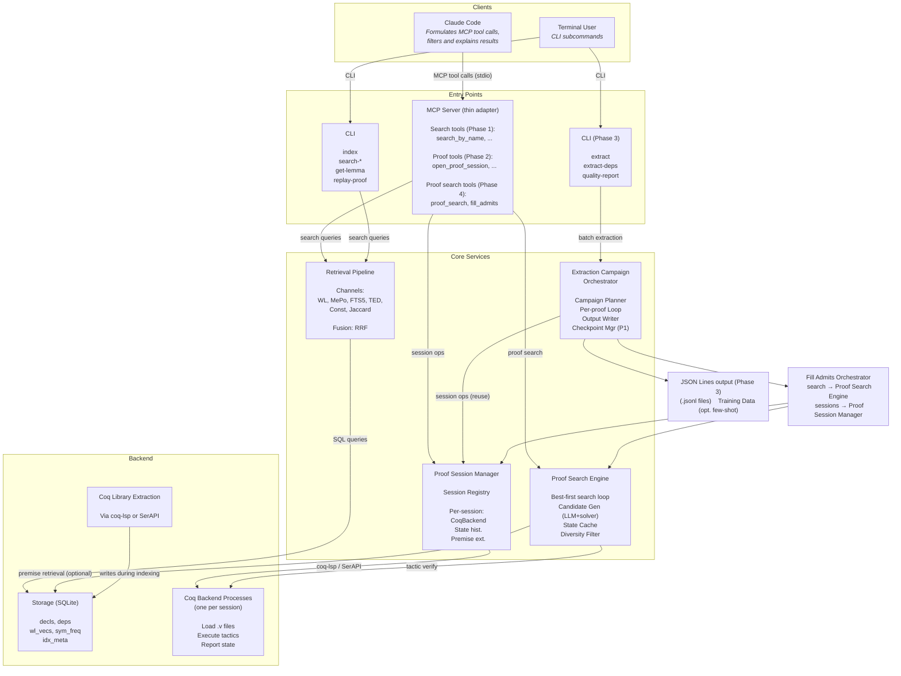
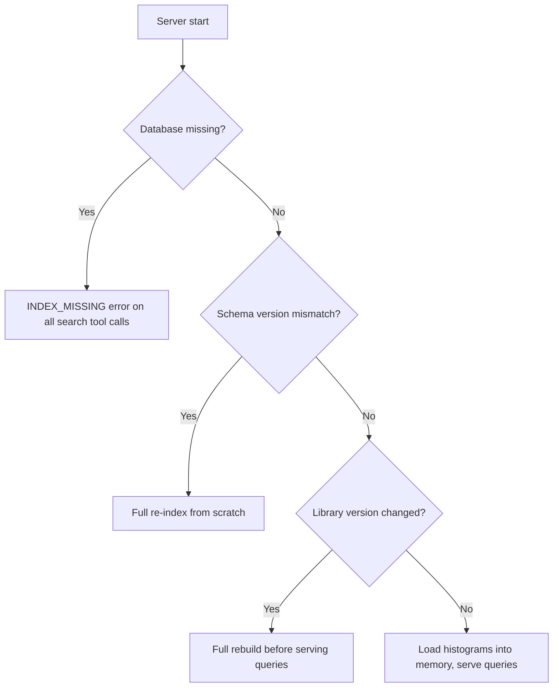

# System Overview

**Feature**: [Semantic Search for Coq/Rocq Libraries](../features/semantic-search.md), [Proof Session Management](../features/proof-session-management.md), [Batch Extraction CLI](../features/batch-extraction-cli.md), [Proof Search](../features/proof-search.md), [Fill Admits](../features/fill-admits.md)

The system has four major subsystems — semantic search (Phase 1), proof interaction (Phase 2), training data extraction (Phase 3), and proof search & automation (Phase 4) — with search, proof interaction, and proof search sharing an MCP server entry point, and extraction operating as a standalone batch pipeline via the CLI. Proof search is the first subsystem that bridges search and proof interaction at runtime.

---

## Component Diagram

## Data Flow

**Offline (indexing)**:
1. Coq Library Extraction reads compiled `.vo` files via coq-lsp or SerAPI
2. Each declaration is converted to an expression tree, normalized, and indexed
3. The Search Backend stores all index data in a single SQLite database

**Server startup (index lifecycle)**:
1. The MCP Server checks for the index database at the configured path
2. If the database is missing, the server returns an `INDEX_MISSING` error on all search tool calls
3. If the database exists, the server reads the `index_meta` table and checks:
   a. Schema version matches the tool's expected version — if not, triggers a full re-index
   b. Library versions match the currently installed versions — if not, triggers a full rebuild
4. Once a valid index is confirmed, the server loads WL histograms into memory and begins serving queries

**Online (search query)**:
1. The LLM in Claude Code receives a user query and formulates MCP tool calls
2. The MCP Server translates search tool calls to Search Backend queries
3. The Search Backend runs the appropriate retrieval channels and fuses results
4. Results flow back through the MCP Server to the LLM
5. The LLM filters, ranks, and explains results to the user

**Online (proof interaction)**:
1. The LLM (or a tool builder) opens a proof session via `open_proof_session`
2. The Proof Session Manager spawns a dedicated Coq backend process for the session
3. The backend loads the .v file and positions at the named proof
4. Subsequent tool calls (submit tactic, observe state, step forward/backward) are routed to the session's backend
5. Proof states are serialized to JSON with a version-stable schema (see [proof-serialization.md](proof-serialization.md))
6. Premise queries trigger analysis of the backend's internal state at each tactic step
7. Trace extraction materializes all states and tactics into a single ProofTrace response
8. When the session is closed (explicitly or by timeout), the backend process is terminated

**Online (proof search)**:
1. The LLM invokes `proof_search` with a session ID; the MCP Server delegates to the Proof Search Engine
2. The engine observes the current proof state via the Proof Session Manager
3. At each search node, the engine generates candidates: solver tactics (tried first, fast) and LLM-generated tactics via Claude API
4. When the Retrieval Pipeline is available, relevant premises are retrieved and included in the LLM prompt
5. When extracted training data is available, similar proof states are retrieved for few-shot context
6. Each candidate is submitted to Coq via the Proof Session Manager; failures are discarded, successes are scored and added to the search frontier
7. The search maintains a state cache (hash-based) to prune duplicate states reached by different tactic paths
8. On success (all goals closed), the engine returns the verified proof script with per-step states
9. On timeout or queue exhaustion, it returns the deepest partial proof and search statistics

**Online (fill admits)**:
1. The LLM invokes `fill_admits` with a file path; the MCP Server delegates to the Fill Admits Orchestrator
2. The orchestrator parses the file to locate `admit` calls syntactically
3. For each admit: opens a proof session, navigates to the admit's position, invokes proof search, collects the result, closes the session
4. Successfully filled admits are replaced with verified tactic sequences in the output script
5. The result includes per-admit outcomes and the modified script

**Batch (training data extraction)**:
1. The terminal user invokes the `extract` CLI subcommand with one or more Coq project directories
2. The Extraction Campaign Orchestrator enumerates .v files and provable theorems in deterministic order
3. For each theorem, the orchestrator creates a proof session via the Proof Session Manager, replays the proof, extracts the trace and premise annotations, then closes the session
4. If a proof fails (tactic error, backend crash, timeout), a structured error record is emitted and extraction continues with the next proof
5. Extracted proof traces are serialized to JSON Lines output — one JSON object per line, one proof per record (see [extraction-output.md](extraction-output.md))
6. Provenance metadata (Coq version, project commit hash, tool version) is recorded in the campaign metadata
7. After all proofs are processed, an extraction summary with per-file and per-project statistics is emitted
8. Incremental re-extraction (P1) re-processes only files that changed since the prior run (see [extraction-checkpointing.md](extraction-checkpointing.md))

## Component Responsibilities

| Component | Responsibility | Does NOT do |
|-----------|---------------|-------------|
| Claude Code / LLM | Intent interpretation, query formulation, result filtering, explanation | Retrieval, indexing, proof state management, batch extraction |
| MCP Server | Protocol translation, input validation, response formatting, proof state serialization | Search logic, storage, session state management, batch extraction |
| CLI | Command-line interface for indexing, search, proof replay, and batch extraction, output formatting | Search logic, session state management |
| Retrieval Pipeline | Retrieval channels, metric computation, fusion, index queries | Coq parsing, user interaction, proof interaction, batch extraction |
| Storage | SQLite schema, index metadata, FTS5 index | Online queries, proof interaction, batch extraction |
| Proof Session Manager | Session lifecycle, Coq backend process management, tactic dispatch, state caching, premise extraction | Search logic, serialization format, protocol translation, project enumeration |
| Coq Library Extraction | Declaration extraction, tree conversion, normalization, index construction | Online queries, proof interaction, batch extraction |
| Extraction Campaign Orchestrator | Project/file enumeration, per-proof extraction loop, failure isolation, streaming JSON Lines output, summary statistics, checkpointing (P1) | Session management, Coq backend communication (delegates to Proof Session Manager) |
| Proof Search Engine | Best-first tree search, candidate generation (LLM + solver + few-shot), state caching, diversity filtering, scoring | Session management, premise selection (delegates to Retrieval Pipeline), protocol translation, serialization format |
| Fill Admits Orchestrator | Admit location in .v files, per-admit session lifecycle, proof search invocation per admit, script assembly | Search algorithm (delegates to Proof Search Engine), Coq backend communication (delegates to Proof Session Manager) |

## Index Lifecycle

The index is a derived artifact. Its lifecycle is managed by the MCP Server on startup:

Re-indexing is always a full rebuild. See [storage.md](storage.md) for the `index_meta` table schema and [mcp-server.md](mcp-server.md) for the error contract.

Note: The four subsystems have distinct dependency patterns. Search and proof interaction are independent of each other. Extraction depends on the Proof Session Manager but not search. Proof search bridges search and proof interaction: it uses the Proof Session Manager for tactic verification and optionally uses the Retrieval Pipeline for premise retrieval. A proof session can be opened and used even when the index is missing or being rebuilt. Proof search degrades gracefully when the search index is unavailable (no premise retrieval) or when training data is unavailable (no few-shot context).
