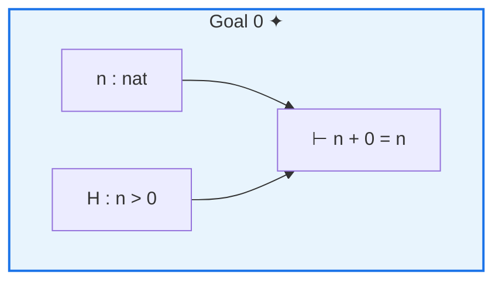
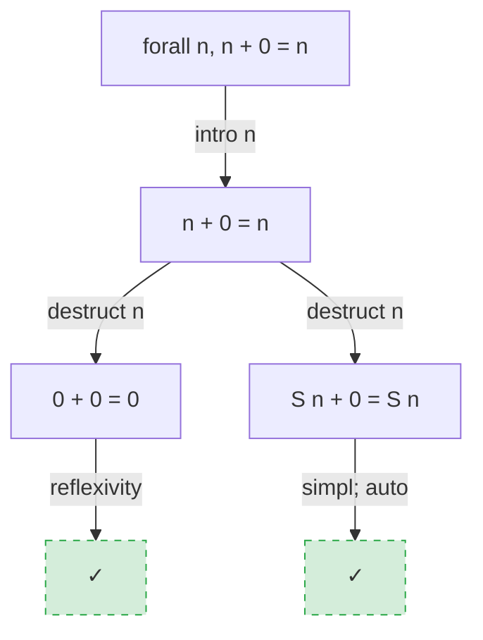
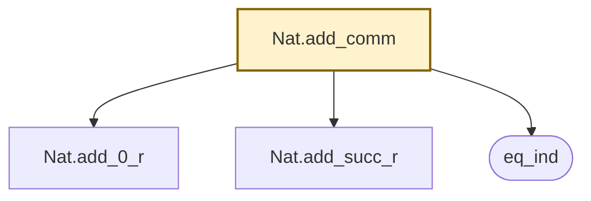

# Mermaid Renderer

Pure function component that transforms proof interaction data structures into valid Mermaid diagram syntax.

**Architecture**: [mermaid-renderer.md](../doc/architecture/mermaid-renderer.md), [data-models/proof-types.md](../doc/architecture/data-models/proof-types.md)

---

## 1. Purpose

Define the Mermaid Renderer that accepts ProofState, ProofTrace, and dependency adjacency data, and returns Mermaid diagram syntax strings suitable for rendering by any Mermaid-compatible service.

## 2. Scope

**In scope**: Text sanitization, proof state diagram generation, proof tree diagram generation, dependency subgraph diagram generation, proof sequence diagram generation, detail level configuration, depth and node limiting, diff annotation for sequence diagrams.

**Out of scope**: Image rendering (owned by external Mermaid services), data resolution from sessions or search index (owned by MCP server), Mermaid syntax parsing or validation (owned by external renderers), proof type definitions (owned by data-models/proof-types).

## 3. Definitions

| Term | Definition |
|------|-----------|
| Mermaid syntax | Text-based diagram description language; the renderer outputs this as a string |
| Detail level | One of `SUMMARY`, `STANDARD`, `DETAILED` — controls how much proof state information appears in a diagram |
| Sanitized text | A Coq expression string with Mermaid-significant characters escaped or transliterated so it renders as literal text |
| Discharged goal | A proof goal that has been fully resolved by a tactic (no remaining subgoals) |
| Dependency subgraph | A subset of the theorem dependency graph rooted at a named theorem, bounded by depth and node count |

## 4. Behavioral Requirements

### 4.1 Text Sanitization

The renderer shall pass all Coq expression text through a single sanitization function before embedding it in Mermaid node labels or edge labels.

#### sanitize(text, max_label_length=80)

- REQUIRES: `text` is a string. `max_label_length` is a positive integer.
- ENSURES: Returns a string safe for use in Mermaid node labels — all Mermaid-significant characters are escaped or transliterated, and the result is at most `max_label_length` characters.
- MAINTAINS: The sanitized string is a recognizable representation of the original Coq expression.

Character handling:

| Character(s) | Handling |
|--------------|----------|
| `[` `]` | Wrap label text in double quotes to prevent Mermaid interpreting as node shape |
| `{` `}` | Wrap label text in double quotes |
| `\|` | Replace with `∣` (U+2223) or escape within quotes |
| `<` `>` | Replace with `&lt;` `&gt;` |
| `"` | Replace with `&quot;` |
| `#` | Replace with `&num;` |
| Newlines | Replace with `<br/>` |

When the sanitized string exceeds `max_label_length`, the renderer shall truncate and append `…`.

> **Given** the Coq expression `forall (n m : nat), n + m = m + n`
> **When** `sanitize` is called with default max_label_length
> **Then** the result is a string that renders as literal text in a Mermaid node label

> **Given** a Coq expression of 120 characters
> **When** `sanitize` is called with max_label_length=80
> **Then** the result is 80 characters ending with `…`

> **Given** the expression `H : {x : nat | x > 0}`
> **When** `sanitize` is called
> **Then** curly braces are escaped so Mermaid does not interpret them as a node shape directive

### 4.2 Proof State Rendering

#### render_proof_state(state, detail_level=STANDARD)

- REQUIRES: `state` is a valid ProofState object. `detail_level` is one of `SUMMARY`, `STANDARD`, `DETAILED`.
- ENSURES: Returns a valid Mermaid flowchart string representing the proof state. The diagram contains one visual group per goal, with hypothesis nodes and a target goal node per group as determined by the detail level.
- MAINTAINS: The focused goal (at `state.focused_goal_index`) is visually distinct from unfocused goals.

When `state.is_complete` is true, the renderer shall return a single-node diagram with the text `Proof complete (Qed)`.

When `state.goals` is empty and `state.is_complete` is false, the renderer shall return a single-node diagram with the text `Empty state`.

Detail level behavior:

| Detail level | Goals shown | Hypotheses shown | Types expanded | Let-bodies shown |
|-------------|-------------|------------------|----------------|------------------|
| `SUMMARY` | Goal count + focused goal type only | No | No | No |
| `STANDARD` | All goals with focused highlighted | Names + sanitized types | No | No |
| `DETAILED` | All goals with focused highlighted | Names + sanitized types | Yes (no abbreviation) | Yes (for let-bound hypotheses) |

The focused goal shall use a distinct Mermaid node style (different fill color or thicker border) to differentiate it from unfocused goals.

Each goal subgraph shall contain:
- One node per hypothesis (at STANDARD and DETAILED levels), labeled `{name} : {sanitized_type}`
- At DETAILED level, let-bound hypotheses append ` := {sanitized_body}`
- One target node labeled `⊢ {sanitized_goal_type}`
- Edges from each hypothesis node to the target node

> **Given** a ProofState with 2 goals, the first focused, with hypotheses `n : nat` and `H : n > 0`
> **When** `render_proof_state` is called with `detail_level=STANDARD`
> **Then** the Mermaid output contains two subgraphs, the first with nodes for `n : nat`, `H : n > 0`, and the goal type, with the first subgraph styled as focused

> **Given** a ProofState with `is_complete=true`
> **When** `render_proof_state` is called
> **Then** the Mermaid output is a single node: `Proof complete (Qed)`

> **Given** a ProofState with 5 goals
> **When** `render_proof_state` is called with `detail_level=SUMMARY`
> **Then** the Mermaid output shows `5 goals` with only the focused goal's type displayed

### 4.3 Proof Tree Rendering

#### render_proof_tree(trace)

- REQUIRES: `trace` is a valid ProofTrace object where the final step's state has `is_complete=true`.
- ENSURES: Returns a valid Mermaid flowchart string (direction: TD — top-down) representing the proof tree. Tactic applications appear as labeled edges. Subgoals appear as nodes. Discharged goals are visually distinct from open goals.

Tree construction from linear trace:

The renderer shall reconstruct the tree structure by comparing consecutive proof states:

1. The root node is the theorem statement from `trace.steps[0].state.goals[0].type`.
2. For each step k (1..N), compare `trace.steps[k-1].state.goals` with `trace.steps[k].state.goals`:
   - Goal identity: two goals are identical if they have the same index AND the same type string. When comparing step k-1 with step k, a goal from k-1 is considered "present in k" if a goal at any index with the same type exists in k (allowing for reordering by Coq tactics like `Focus` and `swap`).
   - Goals present in step k-1 but absent in step k → discharged by tactic k
   - Goals present in step k but absent in step k-1 → introduced by tactic k
   - The parent of introduced goals is the focused goal of step k-1's state
3. Each tactic is an edge label from parent goal node to child goal node(s).
4. Terminal nodes (discharged goals with no children) use a distinct style (dashed border or different fill).

Node ID generation:

Each node shall receive a unique ID derived from its step index and goal index (e.g., `s0g0`, `s3g1`). IDs shall be deterministic — the same input always produces the same IDs.

> **Given** a ProofTrace with 3 steps: initial state → `intro n.` → `induction n.` → (two subgoals discharged by `reflexivity.` and `simpl; auto.`)
> **When** `render_proof_tree` is called
> **Then** the Mermaid output is a tree with the root goal, an `intro n` edge, an `induction n` edge branching into two subgoals, each resolved by their respective tactic edges to discharged leaf nodes

> **Given** a ProofTrace with 1 step where the tactic directly completes the proof
> **When** `render_proof_tree` is called
> **Then** the Mermaid output shows the root node with one edge to a single discharged leaf node

### 4.4 Dependency Subgraph Rendering

#### render_dependencies(theorem_name, adjacency_list, max_depth=2, max_nodes=50)

- REQUIRES: `theorem_name` is a non-empty string. `adjacency_list` is a map from qualified names to lists of `{name, kind}` entries (where `kind` is one of `lemma`, `theorem`, `definition`, `axiom`, `constructor`). `max_depth` is a positive integer. `max_nodes` is a positive integer.
- ENSURES: Returns a valid Mermaid flowchart string (direction: TD) representing the dependency subgraph rooted at `theorem_name`, bounded by `max_depth` hops and `max_nodes` total nodes. Also returns `node_count` (integer) and `truncated` (boolean).

BFS traversal:

1. Start at `theorem_name` (depth 0).
2. For each node at depth d < max_depth, expand its dependencies from `adjacency_list`.
3. Stop expanding a node if total accumulated nodes exceed `max_nodes`.
4. Set `truncated=true` if any nodes were suppressed due to `max_nodes`.
5. When truncation occurs, N = the number of nodes remaining in the BFS frontier (discovered but not yet expanded) at the point truncation was triggered.

Node shapes by kind:

| Kind | Mermaid node shape |
|------|--------------------|
| `theorem`, `lemma` | Rectangle (default) |
| `definition` | Rounded rectangle (`([ ])`) |
| `axiom` | Hexagon (`{{ }}`) |
| `constructor` | Rectangle (default) |

The root node (`theorem_name`) shall use a distinct style (bold border or different fill).

When `theorem_name` is not present in `adjacency_list`, the renderer shall return a single-node diagram with just the theorem name.

When truncation occurs, the renderer shall add a summary node labeled `… and {N} more` connected to the node(s) whose children were suppressed, where N is the number of unexpanded frontier nodes at truncation time.

> **Given** a theorem `Nat.add_comm` with 3 direct dependencies (`Nat.add_0_r`, `Nat.add_succ_r`, `eq_ind`) at depth 1
> **When** `render_dependencies` is called with max_depth=1, max_nodes=50
> **Then** the Mermaid output shows 4 nodes (root + 3 dependencies) with directed edges, and `truncated=false`

> **Given** a theorem with 200 transitive dependencies
> **When** `render_dependencies` is called with max_depth=2, max_nodes=50
> **Then** the diagram contains at most 50 nodes plus a summary node, and `truncated=true`

> **Given** an axiom `Classical_Prop` in the dependency chain
> **When** `render_dependencies` renders it
> **Then** `Classical_Prop` appears as a hexagon-shaped node

### 4.5 Proof Sequence Rendering

#### render_proof_sequence(trace, detail_level=STANDARD)

- REQUIRES: `trace` is a valid ProofTrace object. `detail_level` is one of `SUMMARY`, `STANDARD`, `DETAILED`.
- ENSURES: Returns a list of `{step_index, tactic, mermaid}` entries — one per trace step (length = `total_steps + 1`). Each `mermaid` string is a valid Mermaid flowchart representing the proof state at that step, with diff annotations for steps 1..N.

Diff annotation:

For each step k (1..N), the renderer shall compute a ProofStateDiff between `trace.steps[k-1].state` and `trace.steps[k].state`, then apply the following visual annotations:

| Diff element | Visual annotation |
|-------------|-------------------|
| `goals_added` | New goal subgraphs with highlighted border style |
| `goals_removed` | Omitted from the diagram (they are discharged) |
| `hypotheses_added` | Hypothesis nodes with highlighted style |
| `hypotheses_removed` | Omitted (context is no longer present) |
| `hypotheses_changed` | Hypothesis node with modified style and `(changed)` annotation |
| `goals_changed` | Goal target node with modified style |

Step 0 (initial state) has no diff annotations — it is a plain proof state diagram.

Each entry's `tactic` field is null for step 0 and the tactic string for steps 1..N.

> **Given** a ProofTrace with 3 steps where step 1 introduces hypothesis H via `intro H`
> **When** `render_proof_sequence` is called
> **Then** the returned list has 4 entries; entry at index 1 has `tactic="intro H"` and a Mermaid diagram where hypothesis H is styled as newly added

> **Given** a ProofTrace where step 2 discharges 1 of 2 goals via `assumption`
> **When** `render_proof_sequence` is called
> **Then** entry at index 2 shows only the remaining goal, with the discharged goal omitted

## 5. Data Model

### DetailLevel

| Value | String representation |
|-------|-----------------------|
| `SUMMARY` | `"summary"` |
| `STANDARD` | `"standard"` |
| `DETAILED` | `"detailed"` |

### DependencyEntry

| Field | Type | Constraints |
|-------|------|-------------|
| `name` | qualified name | Required; fully qualified Coq name |
| `kind` | enumeration | Required; one of: `lemma`, `theorem`, `definition`, `axiom`, `constructor` |

### RenderedDiagram (return type for render_dependencies)

| Field | Type | Constraints |
|-------|------|-------------|
| `mermaid` | text | Required; valid Mermaid syntax |
| `node_count` | non-negative integer | Required; number of nodes in the diagram |
| `truncated` | boolean | Required; true if max_nodes caused suppression |

### SequenceEntry (return type for render_proof_sequence)

| Field | Type | Constraints |
|-------|------|-------------|
| `step_index` | non-negative integer | Required; 0 for initial state, 1..N for tactic steps |
| `tactic` | text or null | Required; null for step 0; tactic string for steps 1..N |
| `mermaid` | text | Required; valid Mermaid syntax for the proof state at this step |

All other types (ProofState, ProofTrace, ProofStateDiff, Goal, Hypothesis) are defined in [data-models/proof-types.md](../doc/architecture/data-models/proof-types.md).

## 6. Interface Contracts

### MCP Server → Mermaid Renderer

| Operation | Input | Output | Error strategy |
|-----------|-------|--------|----------------|
| `render_proof_state` | ProofState, DetailLevel | Mermaid string | Never fails for valid ProofState; degenerate inputs produce degenerate but valid diagrams |
| `render_proof_tree` | ProofTrace (completed) | Mermaid string | Never fails for valid completed ProofTrace |
| `render_dependencies` | theorem_name, adjacency_list, max_depth, max_nodes | RenderedDiagram | Never fails; unknown theorem produces single-node diagram |
| `render_proof_sequence` | ProofTrace, DetailLevel | SequenceEntry[] | Never fails for valid ProofTrace |

**Concurrency**: The renderer is stateless — concurrent calls are safe without synchronization.

**Idempotency**: Same input always produces the same output (deterministic node IDs, deterministic layout).

## 7. Error Specification

The renderer does not raise exceptions for valid input types. Instead, degenerate inputs produce degenerate but valid Mermaid diagrams:

| Condition | Behavior |
|-----------|----------|
| Empty proof state (no goals, not complete) | Single-node diagram: `Empty state` |
| Proof trace with 0 steps | Diagram of the initial state only |
| Dependency graph with no edges for the named theorem | Single-node diagram with just the theorem name |
| Sanitizer encounters unrepresentable Unicode | Replace character with `?` |
| Generated diagram exceeds 200 nodes | Truncate with `… and {N} more` summary node (N = unexpanded frontier size); set `truncated=true` |
| `max_label_length` ≤ 0 | Treat as default (80) |
| `max_depth` ≤ 0 | Treat as default (2) |
| `max_nodes` ≤ 0 | Treat as default (50) |

### Edge Cases

| Condition | Behavior |
|-----------|----------|
| Hypothesis name is empty string | Render as `_ : {type}` |
| Goal type is empty string | Render as `⊢ (empty)` |
| ProofTrace where a tactic string is empty | Use edge label `(empty tactic)` |
| Adjacency list contains cycles | BFS naturally handles cycles — visited nodes are not re-expanded |
| Two hypotheses with the same name in a goal | Render both; append goal index to node ID for uniqueness |
| ProofStateDiff with all fields empty (tactic changed nothing visible) | Render the step with no diff annotations and a note `(no visible change)` |

## 8. Non-Functional Requirements

- Diagram generation shall complete in under 2 seconds per proof state on a standard development machine.
- The renderer shall have no runtime dependencies beyond string operations — no rendering libraries, no network calls, no file I/O.
- Node IDs shall be deterministic: the same input always produces the same Mermaid output (byte-identical).
- The renderer shall produce readable diagrams for proofs with up to 50 tactic steps and dependency graphs with up to 100 nodes.

## 9. Examples

### Proof state diagram (STANDARD detail)

Input: ProofState with 1 goal, 2 hypotheses, focused_goal_index=0

Output:


### Proof tree diagram

Input: ProofTrace with 4 steps — `intro n.` → `destruct n.` → `reflexivity.` / `simpl; auto.`

Output:


### Dependency subgraph diagram

Input: `Nat.add_comm` with dependencies `Nat.add_0_r` (lemma), `Nat.add_succ_r` (lemma), `eq_ind` (definition)

Output:


### Proof sequence entry with diff

Input: Step 1 of a trace where `intro H` added hypothesis H

Output (entry at index 1):
```json
{
  "step_index": 1,
  "tactic": "intro H",
  "mermaid": "flowchart TD\n    subgraph goal0[\"Goal 0 ✦\"]\n        h0_0[\"H : P\"]:::added\n        t0[\"⊢ Q\"]\n        h0_0 --> t0\n    end\n    classDef added fill:#d4edda,stroke:#28a745,stroke-width:2px"
}
```

### Error: diagram truncation

Input: Dependency graph with 200 transitive dependencies, max_nodes=50

Output: Diagram with 50 nodes + summary node `… and {N} more` (where N is the number of discovered-but-unexpanded frontier nodes at truncation), `truncated=true`

## 10. Language-Specific Notes (Python)

- Package location: `src/poule/rendering/`.
- Module: `mermaid_renderer.py` — all four rendering functions in one module.
- `DetailLevel` as `enum.Enum` with string values.
- All rendering functions are synchronous (pure computation, no I/O).
- String building via `io.StringIO` or list join for performance on large diagrams.
- The sanitizer is a module-level function, not a class — `sanitize(text: str, max_label_length: int = 80) -> str`.
- Rendering functions return plain strings (or dataclasses for structured returns like `RenderedDiagram`).
- No third-party dependencies — stdlib only.
